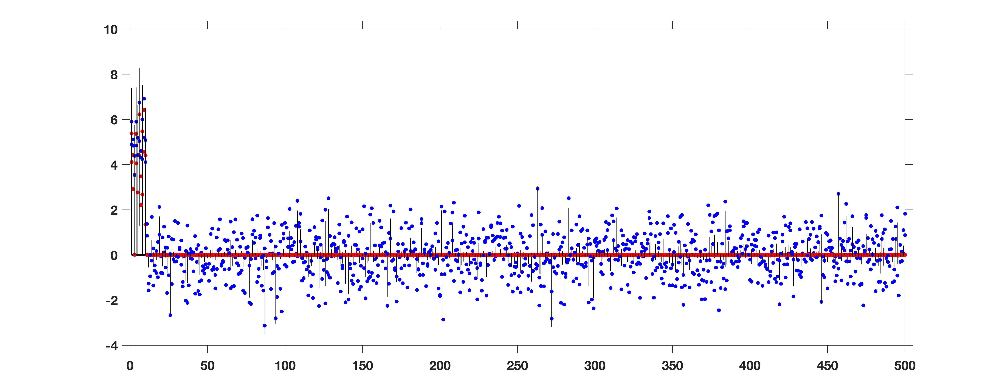

# Dirichlet_Laplace prior for optimal shrinkage

By Bhattacharya, Pati, Pillai and Dunson, published in the Journal of the American Statistical Association (2015), 110 (512): 1479-1489.

## Objective: estimation of a high-dim sparse normal mean theta0  

Model: y ~ N(theta, I_n)

prior for theta: theta_j ~ N(0, psi_j phi_j^2 tau^2), psi_j i.i.d. exp(1/2), 

phi ~ Dir(a,..., a), tau ~ gamma(n*a, 1/2)

## Use the runDL.m script to simulate data and run DL as follows

```matlab

%% Input: y=response, a n*1 vector %%
%%        a= parameter for the Dirichlet
%%        burn= number of burnin MCMC samples %%
%%        nrun= total number of posterior draws, only nrun-burn of them will be saved %%
%%        thin= thinning parameter of the chain %%
%%        plt= binary indicator for plotting posterior median with credible intervals
%%        (blue: datapoints, red: posterior median of theta, black lines: 95% credible intervals
%%        save_samples= binary indicator whether posterior samples should be saved in a file or not %%


%% Output: 
%%         pmeantht= posterior mean of theta, a n by 1 vector%%
%%         pmedtht=posterior median of theta, a n by 1 vector %%
%%         thtout=posterior samples of theta - a matrix of size nrun-burn by n%%

%%%%%%%%%%%%%%%%%%%%%%%%%%%%%%%%%%%%%%%%%%%%%%%%%%%%%%%%%%%%%%%%%

%% simulate data  %%
n=500;                                   % dimension
A=5;                                     % signal strength
qn=10;                                   % # of non-zero signals
theta0=[A*ones(qn,1);  zeros(n- qn, 1)]; % create theta0
y=normrnd(theta0, 1);                    % Draw y ~ N(theta0, I_n)


%% set hyperparameter a of Dirichlet Laplace prior %%
a=1/40;

%% MCMC variables
nrun = 10000; burn = 5000; thin = 1; 

%% Call the function DL %%
plt=1;                                   % Plot data points, posterior mean and credible intervals
save_samples=0;                          % Do not save samples in a separate text file

[pmeantht,pmedtht,thtout]=DL(y,a,burn,nrun,thin,plt,save_samples); 

```
## Output


(blue: datapoints, red: posterior median of theta, black lines: 95% credible intervals)

